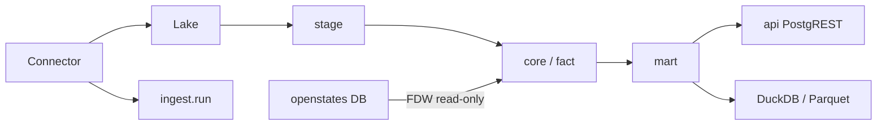

# Architecture Spine — OpenDiscourse

## Design Paradigm

**Layered lakehouse + Connector adapters.** Postgres/PostGIS is the durable
catalog and curated query layer. Immutable files live in the lake. Each
external source is a Connector; shared code owns provenance, identity,
capacity, and persistence.

```
provider → Connector.extract → raw lake → stage → core/fact → mart → api/export
```

Layers map to schemas: `ingest` / `stage` / `core` / `fact` / `mart` / `api`.
Python: `providers/` (HTTP only) → `ingestion/` (pipelines; Connector in
`ingestion/connector.py`) → `repositories/` (SQL only) → `cli.py`
(coordination only).

## Invariants & Rules

### AD-1 — Postgres is the system of record [ADOPTED]

- **Binds:** all durable facts
- **Prevents:** silent dual-writes to Qdrant/DuckDB/files as authority
- **Rule:** Database name is `opendiscourse`. DuckDB/PostgREST/Parquet are
  derived. Another store requires a new AD.
- **ADR:** `docs/adr/0001-postgres-system-of-record.md`

### AD-2 — Connector is the only way to add a source

- **Binds:** CAP-2
- **Prevents:** new `if/elif` in `cli.py`, `plans.py`, `registry.sync`
- **Rule:** Lifecycle is discover → select → plan → extract → evidence →
  stage → normalize → validate → publish → checkpoint. FRED is the reference
  migration; no schema change in that PR.

### AD-3 — Provenance is not optional [ADOPTED]

- **Binds:** CAP-1
- **Prevents:** facts without URL/checksum/run
- **Rule:** Capacity gate fails closed. Raw is immutable. Stage is the only
  auto-evolved layer.

### AD-4 — Wrap, don't rewrite

- **Binds:** CAP-3, CAP-4
- **Prevents:** homegrown Congress/Census/vote scrapers
- **Rule:** Search for a maintained project before writing acquisition code.
  Own evidence and canonical keys; wrap upstream behind the Connector.

### AD-5 — Identity before money or crime

- **Binds:** CAP-4, v1.1 sources
- **Prevents:** name-matched FEC/disclosure joins
- **Rule:** Federal person key is BioGuide via congress-legislators. OCD IDs
  preserved. OpenStates dump is read-only FDW, never mutated.

### AD-6 — BMAD is the software SDD; inventory is the data SDD [ADOPTED]

- **Binds:** CAP-7
- **Prevents:** OpenSpec/Spec Kit/superpowers plans competing with BMAD
- **Rule:** XS/S → `bmad-build`; M → `bmad-spec`; L/XL → PRD/spine/epics.
  `inventory/sources.yaml`, `plans.yaml`, `contracts/` stay the ingest
  authority.

### AD-7 — Persistence split [ADOPTED]

- **Binds:** repositories
- **Prevents:** ORM loops on bulk COPY; string-interpolated SQL
- **Rule:** Alembic for catalog/core/fact/ingest/stage contracts. Raw psycopg
  only for COPY/set-based promotion, OpenStates FDW, and caller-supplied
  legislative transactions.

## Consistency Conventions

| Concern | Convention |
|---|---|
| Database name | `opendiscourse` (CI: `opendiscourse_test`) |
| IDs | Preserve source identifiers; BioGuide for federal people |
| Time | Store vintages; never overwrite historical geography |
| Errors | Actionable resume; `feedback` module for long work |
| Tests | Markers `unit`/`db`/`integration`/`slow`/`live`/`e2e`; no xdist on DB |
| Embeddings | Derived, model-versioned; text remains |

## Stack

| Name | Version / pin |
|---|---|
| PostgreSQL + PostGIS | 17 / 3.5+ (live 3.6.4) |
| pgvector extension | 0.8.5 present; Python extra `search` |
| Python | 3.12 |
| httpx, psycopg, pydantic, typer, tenacity, PyYAML | project pins |
| dlt | staging extra only |
| dbt | marts |
| DuckDB | extra `analytics` |
| PostgREST | v16.3, schema `api` |
| BMAD Method + TEA | 6.12 / 1.26 |

## Structural Seed

```text
src/opendiscourse_research/
  providers/      # HTTP only
  ingestion/      # pipelines; Connector protocol + handler registry
  repositories/   # PostgreSQL only
  cli.py          # coordination
inventory/        # data SDD
sql/              # bootstrap + sql/query/
_bmad-output/     # software SDD artifacts
vendor/           # gitignored upstream clones
```



## Capability → Architecture Map

| Capability | Lives in | Governed by |
|---|---|---|
| CAP-1 Provenance | `ingestion.base`, `ingest.*` | AD-3 |
| CAP-2 Connector | `ingestion/connector.py`; FRED first | AD-2 |
| CAP-3 Wrap votes | `vendor/unitedstates-congress` | AD-4 |
| CAP-4 Identity | congress-legislators → `core.person_identifier` | AD-5 |
| CAP-5 Marts/packs | `dbt/`, `docs/research-source-roadmap.md` | AD-1 |
| CAP-6 Access | `api` schema, DuckDB extra | AD-1 |
| CAP-7 SDD | BMAD + inventory | AD-6 |

## Deferred

- Promoting `real[]` embeddings to pgvector columns (extension exists).
- FEC/disclosure/crime **loads** until CAP-4.
- Prefect as required scheduler.
- GitHub ruleset / extra human reviewers (solo operator).
- Letta and other memory products.
