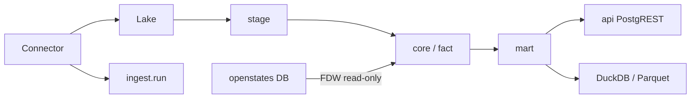

# Architecture Spine — OpenDiscourse

## Design Paradigm

**Layered lakehouse + Connector adapters.** Postgres/PostGIS is the durable
catalog and curated query layer. Immutable files live in the lake. Each
external source is a Connector; shared code owns provenance, identity,
capacity, and persistence.

```
provider → Connector.extract → raw lake → stage → core/fact → mart → api/export
```

Target layers map to schemas: `ingest` / `stage` / `core` / `fact` /
`mart` / `api`. `catalog` and `leg` also exist. `api` is created but has
no reviewed views until Epic 6.1. Ownership: Alembic for
`catalog`/`ingest`/`stage`/`core`/`fact`; dbt for `mart`; published SQL
for `api`; FDW/compatibility for `leg`/`openstates_source`.
Python: `providers/` (HTTP only) → `ingestion/` (pipelines; Connector in
`ingestion/connector.py`) → `repositories/` (SQL only) → `cli.py`
(coordination only).

## Invariants & Rules

### AD-1 — Postgres is the system of record [ADOPTED]

- **Binds:** all durable facts
- **Prevents:** silent dual-writes to Qdrant/DuckDB/files as authority
- **Rule:** Database name is `opendiscourse`. DuckDB/PostgREST/Parquet are
  derived. Another store requires a new AD.
- **ADR:** `docs/adr/0001-postgres-system-of-record.md`

### AD-2 — Connector is the only way to add a source

- **Binds:** CAP-2
- **Prevents:** new `if/elif` in `cli.py`, `plans.py`, `registry.sync`
- **Rule:** Current lifecycle is discover → select → plan → extract →
  evidence → stage → normalize → validate → publish → checkpoint. FRED is
  the reference migration (Story 2.3); no schema change in that PR. Adapters
  may no-op runtime stages (`select`, `evidence`, `publish`, `checkpoint`);
  shared code owns provenance, capacity, and persistence. Do not redesign the
  protocol before FRED e2e is the oracle. Connector v2 is deferred.

### AD-3 — Provenance is not optional [ADOPTED]

- **Binds:** CAP-1
- **Prevents:** facts without URL/checksum/run
- **Rule:** Capacity gate fails closed. Raw is immutable. Stage is the only
  auto-evolved layer.

### AD-4 — Wrap, don't rewrite

- **Binds:** CAP-3, CAP-4
- **Prevents:** homegrown Congress/Census/vote scrapers
- **Rule:** Search for a maintained project before writing acquisition code.
  Own evidence and canonical keys; wrap upstream behind the Connector.

### AD-5 — Identity before politician joins

- **Binds:** CAP-4, v1.1 politician joins
- **Prevents:** name-matched FEC/disclosure/election-member joins
- **Rule:** Federal person key is BioGuide via congress-legislators. OCD IDs
  preserved. Politician *joins* (FEC/disclosure/elections-as-member) wait on
  CAP-4. FEC-native and crime-native *staging* are not identity-blocked; they
  remain v1.1 and must not start until Epic 7 is opened. OpenStates dump is
  read-only FDW, never mutated, never the researcher contract (AD-8).

### AD-6 — BMAD is the software SDD; inventory is the data SDD [ADOPTED]

- **Binds:** CAP-7
- **Prevents:** OpenSpec/Spec Kit/superpowers plans competing with BMAD
- **Rule:** XS/S → `bmad-build`; M → `bmad-spec`; L/XL → PRD/spine/epics.
  `inventory/sources.yaml`, `plans.yaml`, `contracts/` stay the ingest
  authority.

### AD-7 — Persistence split [ADOPTED]

- **Binds:** repositories
- **Prevents:** ORM loops on bulk COPY; string-interpolated SQL
- **Rule:** Alembic for catalog/core/fact/ingest/stage contracts. Raw psycopg
  only for COPY/set-based promotion, OpenStates FDW, and caller-supplied
  legislative transactions.

### AD-8 — OCD language, not the OpenStates dump schema

- **Binds:** CAP-8, FR-9
- **Prevents:** treating `openstates_source.opencivicdata_*` or Django dump
  tables as the public warehouse; writing Congress.gov/GovInfo/clerk rows
  into database `openstates`
- **Rule:** Restore the monthly dump into database `openstates`; read via
  FDW. Canonical entities live in `core`/`fact` using Open Civic Data
  concepts (jurisdiction, session, person, **post**, membership, bill,
  vote), with provenance OpenStates does not own. Combine other legislative
  sources in `core` by identifier (BioGuide, congress+type+number, official
  roll-call id, `ocd_id`). Researchers query `core`/`fact`/`mart`, not FDW.

### AD-9 — Bulk bootstrap, API incremental

- **Binds:** acquisition
- **Prevents:** REST-only historical backfills when an official bulk dump
  exists (GovInfo, ACS Summary File, FEC bulk, OpenStates monthly dump)
- **Rule:** Default is bulk/archive for history, API/feed for freshness,
  immutable evidence always, canonical keys under our control. Not absolute
  per source.

### AD-10 — Schema invariants [ADOPTED]

- **Binds:** CAP-1, CAP-4, CAP-5, CAP-6, CAP-8
- **Prevents:** dual canonical session identity; treating `stage.fec_row` or
  market tables as product scope; generic JSON facts; Alembic/dbt dual-owning
  `mart`
- **Rule:** Internal UUIDs + external identifier tables. Source-derived
  rows need direct evidence; identity/reference exceptions are listed in
  `schema-invariants.md`. Text `jurisdiction`/`legislative_session` on
  `core.bill` and `core.roll_call` are compatibility only. Schema support
  is not authorized ingest. Typed grains. Idempotent unique keys. Keep-and-refine;
  do not redesign from ChatGPT schema reviews.
- **ADR:** `docs/adr/0002-schema-invariants.md`

## Consistency Conventions

| Concern | Convention |
|---|---|
| Database name | `opendiscourse` (CI: `opendiscourse_test`) |
| IDs | Preserve source identifiers; BioGuide for federal people |
| Time | Store vintages; never overwrite historical geography |
| Errors | Actionable resume; `feedback` module for long work |
| Tests | Markers `unit`/`db`/`integration`/`slow`/`live`/`e2e`; no xdist on DB |
| Embeddings | Derived, model-versioned; text remains |

## Stack

| Name | Version / pin |
|---|---|
| PostgreSQL + PostGIS | 17 / 3.5+ (live 3.6.4) |
| pgvector extension | 0.8.5 present; Python extra `search` |
| Python | 3.12 |
| httpx, psycopg, pydantic, typer, tenacity, PyYAML | project pins |
| dlt | staging extra only |
| dbt | marts |
| DuckDB | extra `analytics` |
| PostgREST | v16.3, schema `api` |
| BMAD Method + TEA | 6.12 / 1.26 |

## Structural Seed

```text
src/opendiscourse_research/
  providers/      # HTTP only
  ingestion/      # plan/preview/load; future Connector
  repositories/   # PostgreSQL only
  cli.py          # coordination
inventory/        # data SDD
sql/              # bootstrap + sql/query/
_bmad-output/     # software SDD artifacts
vendor/           # gitignored upstream clones
```



## Capability → Architecture Map

| Capability | Lives in | Governed by |
|---|---|---|
| CAP-1 Provenance | `ingestion.base`, `ingest.*` | AD-3, AD-10 |
| CAP-2 Connector | `ingestion/connector.py`; FRED first | AD-2 |
| CAP-3 Wrap votes | `vendor/unitedstates-congress` | AD-4 |
| CAP-4 Identity | congress-legislators → `core.person_identifier` | AD-5, AD-10 |
| CAP-5 Marts/packs | `dbt/`, `docs/research-source-roadmap.md` | AD-1, AD-10 |
| CAP-6 Access | `api` schema, DuckDB extra | AD-1, AD-10 |
| CAP-7 SDD | BMAD + inventory | AD-6 |
| CAP-8 Legislative primitives | `core` post/division/membership; OpenStates promote | AD-8, AD-10 |

## Deferred

- Promoting `real[]` embeddings to pgvector columns (extension exists).
- Connector protocol v2 (typed acquire/stage results; runtime-owned
  evidence). Finish Story 2.3 first.
- Package split (`acquisition/` / `sources/` / `domains/`).
- Dropping SQLModel; `ty`/`sqlfluff`/`ruff format` as merge gates.
- Moving `core.instrument` / `fact.market_bar` to CFA (deprecate in docs
  first; tables stay empty).
- Materializing the full OpenStates canonical subset (Epic 8 then later
  promote stories).
- FEC-native / crime-native staging until Epic 7 is opened (not blocked on
  BioGuide, still out of v1). Existing `stage.fec_row` is not a green light.
- Dropping textual `jurisdiction`/`legislative_session` from `core.bill` and
  `core.roll_call` unique keys.
- `core.geography_relationship` (typed, dated overlaps). `parent_geoid`
  stays a loose string in v1.
- Provenance CHECK audit for class-A tables missing constraints
  (`geography_boundary`, `document`).
- Prefect as required scheduler.
- GitHub ruleset / extra human reviewers (solo operator).
- Letta and other memory products.
