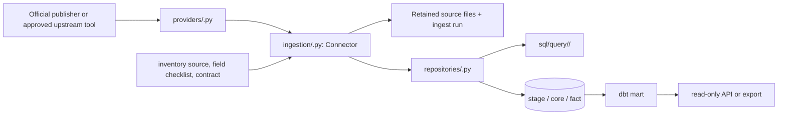

# Source and Connector Boundary Guide

## Plain-language rule

Every outside publisher gets a small, self-contained adapter. Shared code handles
the rules that must be identical for every source: retained evidence, capacity,
run tracking, identity safeguards, transactions, and test conventions. A source
must never teach a shared module about its special cases.

This guide refines the existing architecture spine; it does not authorize a
large code move or a Connector-protocol redesign.



## One source, one home

Use the publisher/domain name consistently: `voteview`, `fec`, `cbo`, `lda`,
`usaspending`, and so on. The stable catalog id remains dot-separated, such as
`congress.voteview` or `fec.campaign_finance`.

| Location | Owns | Must not contain |
|---|---|---|
| `inventory/sources.yaml` | dataset id, publisher, access method, grain, stable identifiers, cadence, priority | parsing or SQL |
| `inventory/fields/<dataset>.yaml` | every offered field and whether it is typed, retained whole, or deliberately excluded | vague “all fields” claims |
| `providers/<source>.py` | URLs, authentication, HTTP headers, pagination/download protocol, upstream-tool invocation | database writes, data-model decisions, SQL |
| `ingestion/<source>.py` | the ten Connector stages, source parsing, source-specific validation, resume reporting | inline multi-line SQL, a central dispatcher branch |
| `repositories/<source>.py` | transaction-shaped database operations and named-query calls | HTTP requests, source-specific download logic |
| `sql/query/<source>/` | parameterized source-specific SQL | Python business logic |
| `tests/test_<source>_connector.py` | source contract: happy path, malformed input, resume, idempotency, evidence, identity gaps, coverage | dependence on the live warehouse |

`cli.py` is a front door only: parse options, construct the Connector, report a
result, and choose an exit code. A source command may appear there, but it must
not contain parsing, SQL, or source rules.

## Hierarchy of responsibility

The direction of dependency is one way:

```text
CLI → Connector → provider and repository → named SQL → database
                 ↘ shared safeguards (evidence, capacity, identity, feedback)
```

The reverse directions are forbidden. In particular:

- a provider never imports a repository or opens a database connection;
- a repository never makes an HTTP request;
- SQL never calls external services;
- a source never adds an `if/elif` branch to shared registry or plan dispatch;
- a display name never creates a person link;
- a downstream mart never becomes the only copy of a source fact.

## What is shared versus source-specific

Share code only after **two sources** need the same behavior, the same failure
semantics, and the same tests. Before that, keep the logic beside the source.
This avoids a misleading generic framework that is really Voteview or FEC code
in disguise.

Good shared components are already evident: artifact retention, capacity
previews, ingestion runs, feedback/progress display, identity gates, named SQL
loading, and the Connector runner.

Source-specific components include field parsing, publisher manifests,
pagination quirks, identifiers, coverage comparisons, and the mapping from a
source record to its typed database grain.

## Required source workflow

Before implementation:

1. Write or update the source inventory entry and a field checklist from the
   publisher documentation and a real sample file.
2. Search for maintained upstream tools. Record one of three outcomes in
   `reuse.md`: **wrap**, **reference only**, or **do not use**.
3. Define the grain—the meaning of one database row—and its stable source key.
4. Define identity behavior explicitly. Unknown or conflicting identities stay
   unlinked and are reported; they are never name-matched.
5. Define the expected bytes, storage cost, source terms, and coverage measure
   before a large download.

During implementation:

1. Retain original bytes first; do not overwrite evidence.
2. Keep the complete source record where it contains many fields, then add
   query-friendly typed columns for the fields we use often.
3. Publish derived rows in one safe transaction or a documented resumable unit.
4. Keep a failed refresh from hiding the most recent usable artifact.

Before calling a source complete:

1. Run source tests, including failure, repeat, resume, and provenance cases.
2. Compare loaded counts with the publisher’s manifest or count.
3. Record unresolved gaps in the run output and `docs/PROJECT-STATE.md`.
4. Update the field checklist; no unrecorded dropped fields are allowed.

## Future package shape

Do not reorganize the existing code tree wholesale. The current folders are the
right top-level shape. Apply the following “no further growth” rule instead:

- `cli.py` must shrink in responsibility over time; new source behavior belongs
  in its Connector, not in a new command-body branch.
- `repositories/legislation.py` is a shared domain repository, not a place to
  put arbitrary new-source persistence. New source families receive their own
  repository once their operations are not genuinely shared legislative
  primitives.
- A source Connector may split parser-only helpers into
  `ingestion/<source>_parse.py` when parsing is independently testable or when
  its Connector would otherwise mix acquisition and parsing. Do not split merely
  to meet a line-count target.
- An upstream package is called only behind `providers/<source>.py`. It may be
  an optional dependency, but it never reads a machine-specific cache or writes
  warehouse tables directly.

## Naming rules

Use names that say both **whose data** and **what role the code has**:

```text
VoteviewConnector
VoteviewClient
publish_voteview
sql/query/voteview/replace_roll_calls.sql
inventory/fields/congress.voteview.yaml
```

Avoid catch-all names such as `utils`, `helpers`, `loader`, `data`, or
`politics`. A helper with no source name must represent a real cross-source
concept, such as `retain_artifact_bytes` or `storage_preview`.

## Current assessment

The recent Voteview and committee-membership work follows this guide: provider,
Connector, repository, named SQL, field checklist, and source test are separate.
That is the pattern to copy.

The codebase does have two growth warning signs: `cli.py` is already large, and
`repositories/legislation.py` is a broad shared module. Treat both as boundary
lines rather than dumping grounds. This is a controlled refactoring concern,
not a reason to halt the current Voteview work or redesign the Connector
protocol.

## Next enforcement work

1. Add a small architecture test that rejects new multi-line SQL outside
   `sql/query/` (the project already has this as planned cleanup work).
2. Add a source-template/checklist command or documented scaffold that creates
   the expected inventory, provider, Connector, repository, SQL, and test
   locations without creating empty production code.
3. Update `reuse.md` to remove its obsolete Voteview scraper instruction.
4. Complete the field audits of already-loaded sources before expanding into
   money, elections, or disclosure data.
